[](https://mseep.ai/app/keshavsharma-code-deepsleep-beta)

<div align="center">

# 🧠 DeepSleep — Local AI Memory for Developers


[](https://pepy.tech/project/deepsleep-ai)

### Your AI finally remembers you.

*Local-first AI coding memory. Watches your files while you work, generates summaries while you're idle, answers "what was I working on?" in under a second — completely free, no cloud, no API key.*

*Works with Ollama · VS Code · Cursor · Windsurf · Claude Desktop · MCP · Neural Link.*

[](https://pepy.tech/project/deepsleep-ai)
[](https://pypi.org/project/deepsleep-ai/)
[](https://pypi.org/project/deepsleep-ai/)
[](https://github.com/Keshavsharma-code/DeepSleep-beta/actions/workflows/ci.yml)
[](./LICENSE)
[](https://github.com/Keshavsharma-code/DeepSleep-beta/stargazers)
[](https://modelcontextprotocol.io)
[](#-neural-link--cross-project-memory)
[](#v023--cloud-api-fallback)
[](#v030--vs-code-extension-the-memory-sidebar)

<br>

<a href="https://pypi.org/project/deepsleep-ai/">
  
</a>

<br><br>

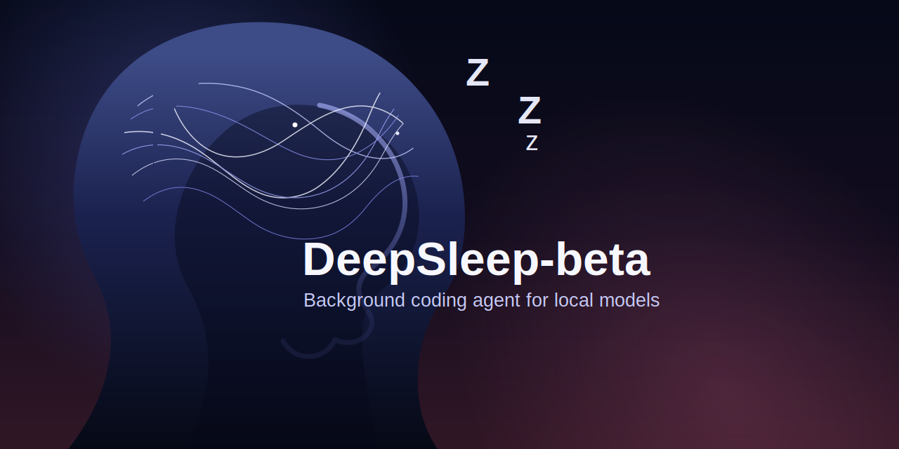

</div>

---

> **You open Cursor. You explain your project. Again.**
> Next day — same thing. Different AI session, same blank slate.
> You've typed *"I'm building a SaaS, Python backend, auth is broken"* 300 times.
> DeepSleep remembers it so you never have to.
>
> It runs in the background. Watches your files. When you go idle it reads what you touched and writes a summary — locally, for free. Next time you open Cursor, it already knows. No re-explaining. No context window wasted. No subscription.
>
> And three weeks later when you've forgotten which repo had that JWT fix — `ds search "jwt"` finds it in 200ms across every project you've ever touched.

---

## The problem with every AI coding tool right now

You open Cursor. You open Claude. You open Copilot.

And every single time, you have to **re-explain yourself.**

> *"I'm working on a SaaS app, Python backend, the auth is broken, here's the context..."*

You've typed that paragraph 300 times. The AI has the memory of a goldfish. And it's not just annoying — it's actively making you slower.

Then it gets worse. Three weeks later, different project:

> *"I've fixed this exact JWT validation bug before. I know I have. Which repo was it in?"*

You dig through 12 repos. You grep across branches. You find nothing.

**That's 40 minutes gone.** On a problem you already solved.

---

## DeepSleep fixes both. Permanently.

```
pip install deepsleep-ai && ds init && ds dream
```

That's it. DeepSleep now runs in the background. It watches your files. When you go idle, it dreams — reads what you touched, builds a summary, stores it locally. When you come back, it already knows what you were doing.

And with **Neural Link** (v0.2.1), it connects every project on your machine into one searchable brain.

> **No cloud. No tokens burned. No subscription. $0 forever.**

---

## Evolution — From Tool to Oracle

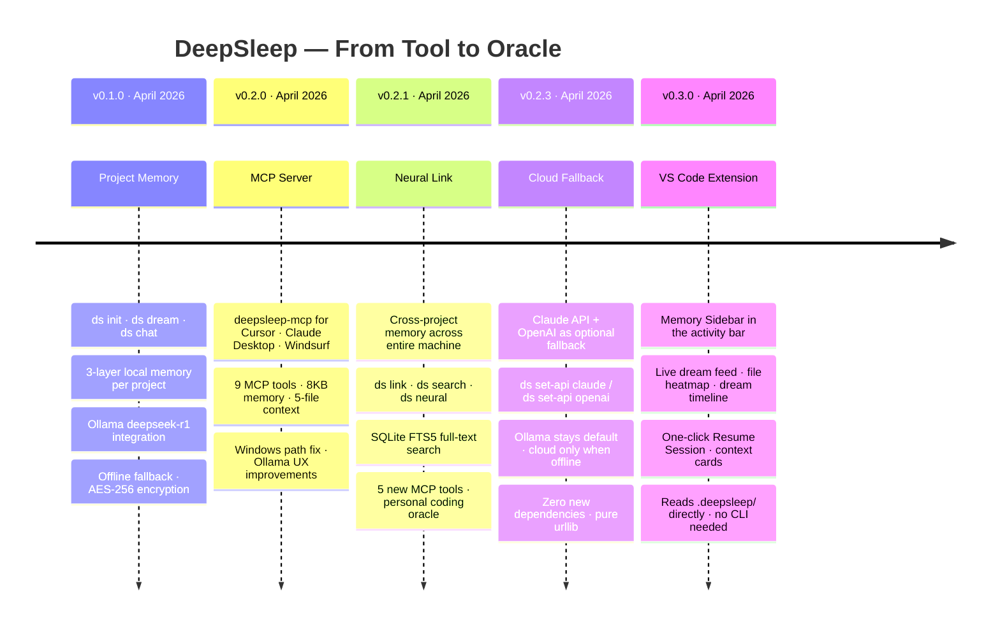

---

## v0.1 — Project Memory

> *"What was I working on?"* — answered in under a second, locally, for free.

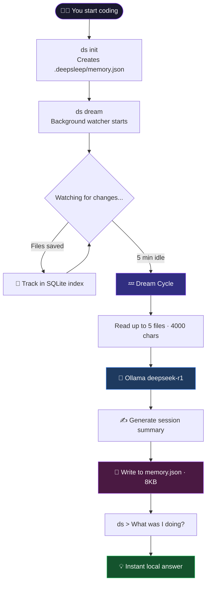

**Everything lives in one 8KB file. Three layers. Always under budget.**

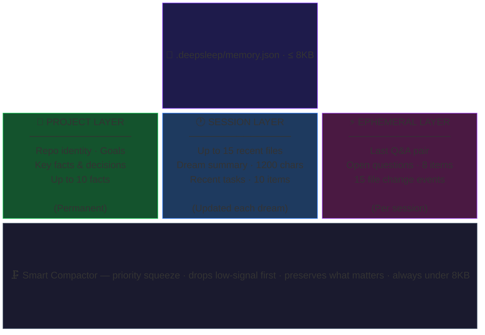

---

## v0.2 — MCP Server

> *Open Cursor. Your AI already knows what you were doing. You didn't have to type a single word.*

This is what MCP unlocks. One JSON config block in your IDE. DeepSleep becomes a native memory layer — Cursor, Claude Desktop, and Windsurf can query it directly through the Model Context Protocol.

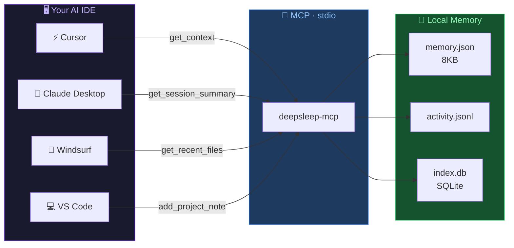

Your AI starts saying things like:

> *"You were debugging the JWT middleware 3 hours ago. `auth.ts` and `middleware.py` were open. You were stuck on token validation."*

Without you touching a thing.

---

## v0.2.1 — Neural Link

> *You solved this exact bug in `backend-api` two weeks ago. Want me to show you that snippet?*

Neural Link is the part that makes DeepSleep feel supernatural. It connects every project on your machine into one searchable, pattern-aware brain — backed by SQLite FTS5, zero cloud required.

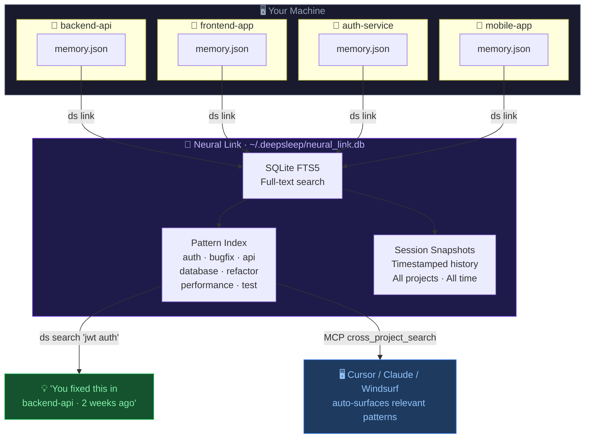

**It classifies patterns automatically. No ML. Just fast keyword scoring.**

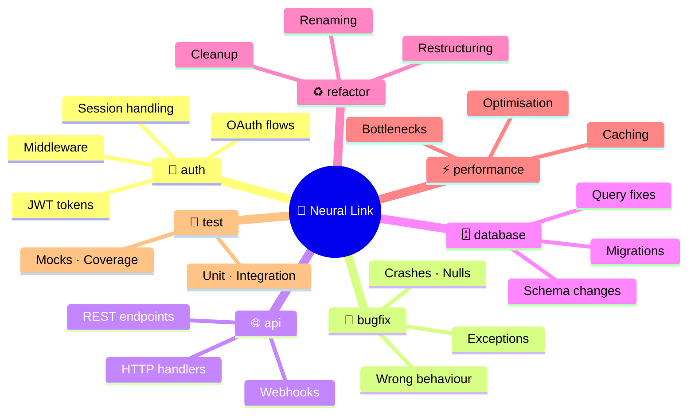

---

## Security Architecture

Your code never leaves the machine. Here's exactly what's sandboxed and how.

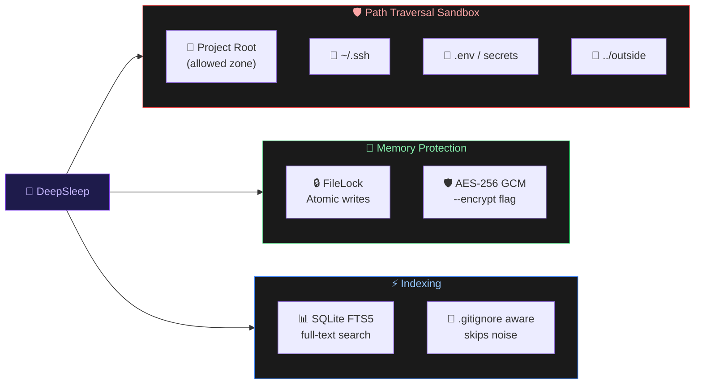

---

## Why Local-First Wins

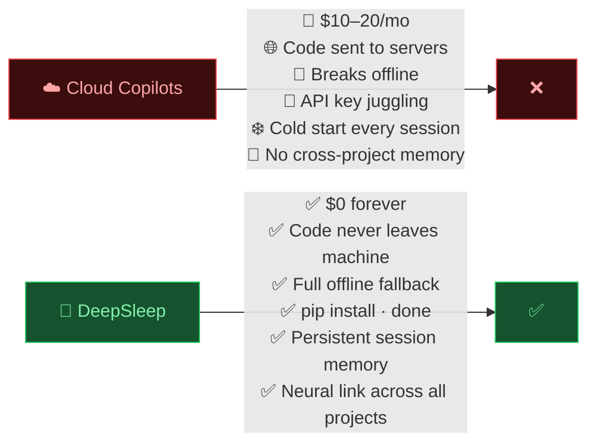

---

## v0.2.3 — Cloud API Fallback

> *No Ollama? No problem. Paste one key. DeepSleep keeps working.*

The #1 reason developers bounce: Ollama setup friction. v0.2.3 removes it entirely.

You're still **local-first**. Your code never leaves the machine unless Ollama is down **and** you've explicitly set a key. The moment Ollama comes back up, it takes over automatically — no config change needed.

### How the fallback chain works

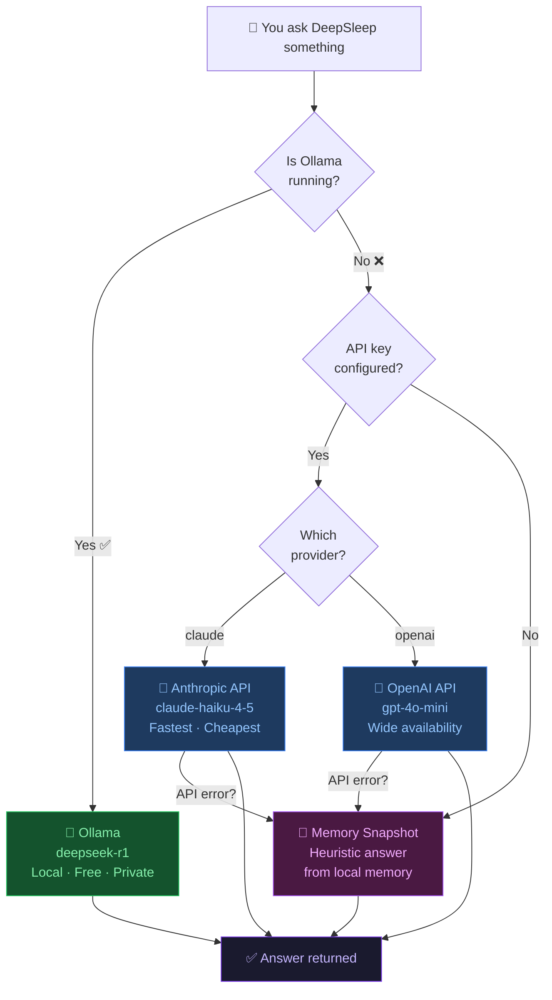

### Step-by-step setup

**Option A — Set up after init (most common)**

```bash
# Already have DeepSleep? Just run:
ds set-api claude      # uses Anthropic API
# or
ds set-api openai      # uses OpenAI API
```

DeepSleep prompts for your key, stores it at `~/.deepsleep/api_config.json`, done.

**Option B — Set up at init time**

```bash
cd your-project/
ds init --fallback-api claude
# or
ds init --fallback-api openai
```

**Option C — Remove the key**

```bash
ds set-api remove
```

### Where to get your API key

| Provider | Key format | Where to get it |
|----------|-----------|----------------|
| Anthropic | `sk-ant-api03-...` | [console.anthropic.com/keys](https://console.anthropic.com/keys) |
| OpenAI | `sk-proj-...` | [platform.openai.com/api-keys](https://platform.openai.com/api-keys) |

### What you see in the terminal

When Ollama is offline and a fallback key is set, the banner shows:

```
  project=myapp  model=deepseek-r1  ollama=offline  fallback=claude
```

When no key is set:

```
  project=myapp  model=deepseek-r1  ollama=offline  fallback=none (tip: ds set-api claude)
```

### Error handling — what happens when things go wrong

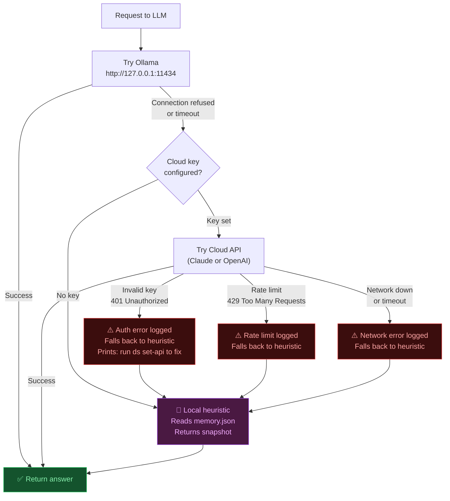

**The key guarantee: DeepSleep never crashes because of a missing or broken API key.** It always returns something — worst case your local memory snapshot.

### Common error scenarios and fixes

| What you see | What happened | Fix |
|---|---|---|
| `Ollama offline — using claude-haiku-4-5 as fallback.` | Working as intended | Nothing — this is normal |
| `claude API error: authentication_error` | Bad or expired key | `ds set-api claude` to re-enter key |
| `claude API error: insufficient_quota` | Account out of credits | Top up at console.anthropic.com |
| `openai API error: invalid_api_key` | Bad key | `ds set-api openai` to re-enter |
| `openai API unavailable: <urlopen error>` | No internet or OpenAI down | DeepSleep auto-falls back to memory snapshot |
| `fallback=none` shown in banner | No key configured | Run `ds set-api claude` or `ds set-api openai` |
| Answer feels generic / shallow | Running on memory snapshot | Either start Ollama or set a cloud key |

### Check your current setup

```bash
ds doctor
```

Output includes a `cloud-fallback` line:

```
OK    project-root
OK    memory-file
OK    ollama-host
WARN  ollama-model        ← Ollama is off, but that's OK if you have a fallback
OK    cloud-fallback      ← key is stored and provider is recognized
OK    disk-space
```

If `cloud-fallback` shows `WARN`, run `ds set-api claude` or `ds set-api openai`.

### Privacy model — exactly what goes where

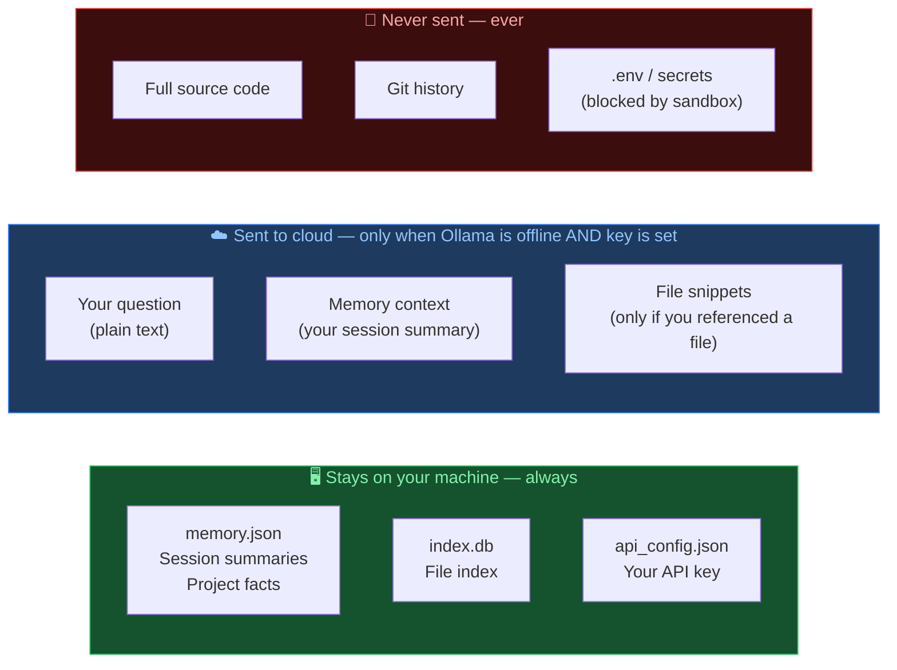

### Who should use cloud fallback

| Scenario | Recommended setup |
|----------|------------------|
| Laptop on a flight (Ollama offline) | Set key — seamless fallback |
| Windows dev, no Ollama installed | `pip install deepsleep-ai && ds set-api openai` |
| Privacy-first / air-gapped | Don't set a key — behavior unchanged |
| Team sharing a project | Each dev sets their own key locally |
| CI / scripted use | Set `DEEPSLEEP_` env vars instead of key file |

---

## v0.3.0 — VS Code Extension: The Memory Sidebar

DeepSleep is no longer terminal-only. The **Memory Sidebar** brings everything into your editor — a live visual panel docked in the VS Code activity bar.

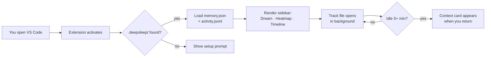

### What the sidebar shows

```
┌─────────────────────────────────┐
│  💤  Memory Sidebar    [2h 14m] │  ← session clock
├─────────────────────────────────┤
│  LAST DREAM                     │
│  ● "Rewrote auth middleware,    │  ← live summary from ds watch
│    fixed JWT expiry edge case,  │
│    added tests for /refresh"    │
│                     3h ago · deepseek-r1 │
├─────────────────────────────────┤
│  RECENT TASKS                   │
│  › what was I working on?       │  ← last chat messages
│  › show me the auth fix         │
├─────────────────────────────────┤
│  FILE HEATMAP                   │
│  auth.py        ████████  8     │  ← bar = opens this session
│  routes.py      █████     5     │
│  test_auth.py   ██        2     │
├─────────────────────────────────┤
│  DREAM TIMELINE                 │
│  ● 3h ago  "Rewrote auth..."    │  ← every dream ever recorded
│  ● 1d ago  "Set up DB layer..." │
│  ● 3d ago  "Init, added CI..."  │
├─────────────────────────────────┤
│  [ ▶ Resume Session ]           │  ← reopens last 8 files
└─────────────────────────────────┘
```

### Install (3 steps)

**Option A — from VSIX (recommended for now)**

```bash
# 1. Clone the repo
git clone https://github.com/Keshavsharma-code/DeepSleep-beta.git
cd DeepSleep-beta/vscode-extension

# 2. Install deps and package
npm install
npx @vscode/vsce package

# 3. Install into VS Code
code --install-extension deepsleep-memory-0.1.0.vsix
```

**Option B — developer mode (live reload)**

```bash
cd DeepSleep-beta/vscode-extension
npm install
# Open the folder in VS Code, then press F5
# A new Extension Development Host window opens with the sidebar active
```

### How Resume Session works

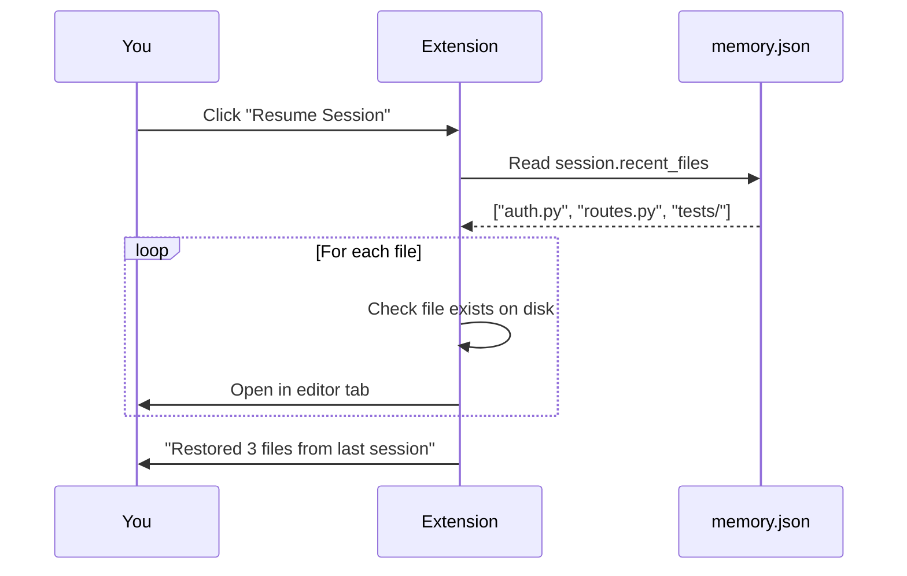

### Context cards

When you reopen a file after 60+ minutes away, a toast fires:

```
💤 DeepSleep: Resuming work on auth.py   [Show Context]  [Dismiss]
```

Clicking **Show Context** focuses the sidebar and highlights the file in the heatmap.

### Settings

| Setting | Default | What it does |
|---------|---------|-------------|
| `deepsleep.contextCardOnReopen` | `true` | Show toast when reopening known files |
| `deepsleep.contextCardBreakMinutes` | `60` | Minutes of idle before a reopen counts as a "break" |
| `deepsleep.globalDataDir` | auto | Override path to `~/.deepsleep` |

---

## Quickstart

### Step 1 — Install Ollama (one-time, optional but recommended)

```bash
# macOS
brew install ollama

# Linux
curl -fsSL https://ollama.com/install.sh | sh

# Windows — download from https://ollama.com/download/windows
```

```bash
ollama serve
ollama pull deepseek-r1
```

> **No Ollama?** DeepSleep still works — it falls back to its local memory snapshot. Or set `ds set-api claude` / `ds set-api openai` for full AI answers without Ollama.

### Step 2 — Install DeepSleep

```bash
# Core CLI
pip install deepsleep-ai

# With MCP server (Cursor · Claude Desktop · Windsurf)
pip install 'deepsleep-ai[mcp]'
```

### Step 3 — Initialize your project

```bash
cd your-project/
ds init

# With AES-256 encrypted memory
ds init --encrypt
```

### Step 4 — Start watching

```bash
ds dream
# DeepSleep is running. Go code. It's watching.
```

### Step 5 — Ask it anything

```bash
ds
> What was I working on?
> What files did I touch today?
> What's the next step?
> Summarize my session
```

> **One-liner:**
> ```bash
> pip install deepsleep-ai && ollama pull deepseek-r1 && ds init && ds dream --once && ds
> ```

---

## Neural Link — Full Setup Guide

### What is the Neural Link?

The Neural Link indexes session memory from every DeepSleep-enabled project on your machine into a single SQLite FTS5 database at `~/.deepsleep/neural_link.db`. It powers cross-project search and pattern recognition — your entire coding history, searchable in milliseconds.

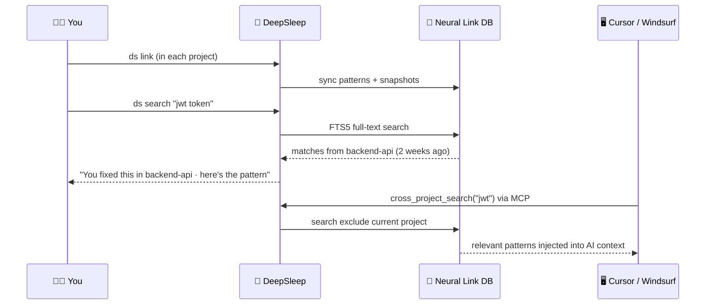

### Step 1 — Link your projects

Run this once in each project you want indexed:

```bash
cd ~/projects/backend-api && ds link
cd ~/projects/frontend-app && ds link
cd ~/projects/auth-service && ds link
```

### Step 2 — Search across everything

```bash
# Natural language search across all projects
ds search "jwt token validation"
ds search "database migration rollback"
ds search "react component state bug"

# Filter by pattern type
ds search "auth" --type auth
ds search "crash on deploy" --type bugfix

# See global context
ds neural
ds neural --query "oauth middleware"
```

### Step 3 — Keep it updated

```bash
# Re-sync after a big session (runs automatically with ds dream too)
ds link --sync

# Remove a project from the index
ds unlink
```

---

## MCP Server — Full Setup Guide

### Install

```bash
pip install 'deepsleep-ai[mcp]'
```

### Configure Claude Desktop

`~/.claude/config.json`:
```json
{
  "mcpServers": {
    "deepsleep": {
      "command": "deepsleep-mcp",
      "args": ["--path", "/absolute/path/to/your/project"]
    }
  }
}
```

### Configure Cursor

`.cursor/mcp.json` in your project:
```json
{
  "mcpServers": {
    "deepsleep": {
      "command": "deepsleep-mcp",
      "args": ["--path", "/absolute/path/to/your/project"]
    }
  }
}
```

### Configure Windsurf

`~/.codeium/windsurf/mcp_config.json`:
```json
{
  "mcpServers": {
    "deepsleep": {
      "command": "deepsleep-mcp",
      "args": ["--path", "/absolute/path/to/your/project"]
    }
  }
}
```

### Start manually

```bash
ds mcp /path/to/your/project
# or
deepsleep-mcp --path /path/to/your/project
```

### All MCP Tools

**Project memory (v0.2.0+)**

| Tool | What it returns |
|------|----------------|
| `get_context` | Full 3-layer memory — call this first |
| `get_session_summary` | Latest dream summary + timestamp |
| `get_recent_files` | Recently modified files |
| `get_status` | Project status dict |
| `get_activity_log` | Filtered activity entries |
| `get_open_questions` | Unresolved questions |
| `get_project_facts` | Long-term summary, goals, facts |
| `record_file_opened` | Tell DeepSleep a file was opened |
| `add_project_note` | Save a note to long-term memory |

**Neural Link (v0.2.1+)**

| Tool | What it returns |
|------|----------------|
| `cross_project_search` | FTS search across all linked projects |
| `get_neural_context` | Full cross-project context string |
| `get_similar_patterns` | Recent patterns of a given type from other projects |
| `get_neural_link_stats` | Index stats — projects, snapshots, patterns |
| `sync_to_neural_link` | Push current session into global index |

---

## Commands Reference

| Command | What it does |
|---------|-------------|
| `ds init` | Initialize project memory |
| `ds init --encrypt` | AES-256 encrypted memory |
| `ds` | Interactive chat |
| `ds chat` | Alias for `ds` |
| `ds dream` | Start background file watcher |
| `ds dream --once` | One dream cycle and exit |
| `ds status` | Inspect memory snapshot |
| `ds export` | Markdown standup report |
| `ds export --format json` | JSON export |
| `ds forget --layer session` | Wipe session layer |
| `ds forget --all` | Full reset (with confirmation) |
| `ds doctor` | Quick health check |
| `ds health` | Detailed JSON health report |
| `ds mcp [path]` | Start MCP server |
| `deepsleep-mcp --path /p` | Standalone MCP entry point |
| `ds link` | Register + sync project into Neural Link |
| `ds link --no-sync` | Register without syncing |
| `ds unlink` | Remove project from Neural Link |
| `ds search "query"` | Cross-project FTS search |
| `ds search "q" --type auth` | Filtered pattern search |
| `ds neural` | Show global Neural Link context |
| `ds neural --query "q"` | Filtered cross-project context |
| `ds set-api claude` | Store Claude API key as Ollama fallback |
| `ds set-api openai` | Store OpenAI API key as Ollama fallback |
| `ds set-api remove` | Remove stored cloud API key |
| `ds init --fallback-api claude` | Init + configure fallback in one step |

---

## Feature Overview

| Feature | v0.1 | v0.2 | v0.2.1 | v0.2.3 | v0.3 |
|---------|:----:|:----:|:------:|:------:|:----:|
| Per-project memory | ✅ | ✅ | ✅ | ✅ | ✅ |
| Idle-time dreaming | ✅ | ✅ | ✅ | ✅ | ✅ |
| Ollama / offline fallback | ✅ | ✅ | ✅ | ✅ | ✅ |
| AES-256 encryption | ✅ | ✅ | ✅ | ✅ | ✅ |
| 8KB memory budget | | ✅ | ✅ | ✅ | ✅ |
| 5-file / 4000-char context | | ✅ | ✅ | ✅ | ✅ |
| MCP server | | ✅ | ✅ | ✅ | ✅ |
| Cursor / Windsurf / Claude support | | ✅ | ✅ | ✅ | ✅ |
| Windows path normalization | | ✅ | ✅ | ✅ | ✅ |
| Neural Link cross-project index | | | ✅ | ✅ | ✅ |
| FTS5 full-text search | | | ✅ | ✅ | ✅ |
| Pattern classification | | | ✅ | ✅ | ✅ |
| Neural Link MCP tools | | | ✅ | ✅ | ✅ |
| Claude API fallback | | | | ✅ | ✅ |
| OpenAI API fallback | | | | ✅ | ✅ |
| Zero new dependencies | | | | ✅ | ✅ |
| VS Code Memory Sidebar | | | | | ✅ |
| Live file heatmap | | | | | ✅ |
| Dream timeline in editor | | | | | ✅ |
| One-click session restore | | | | | ✅ |
| Context cards on file reopen | | | | | ✅ |

---

## Troubleshooting

### Ollama issues

| Problem | Fix |
|---------|-----|
| `Ollama is not running` | Run `ollama serve` in a terminal and keep it open |
| `model not found` | Run `ollama pull deepseek-r1` |
| `Connection refused` | Check Ollama is on `http://127.0.0.1:11434` — run `ds health` |
| Empty / garbage answers | Try a lighter model: `ds --model phi3` |
| Slow on first call | Normal — model is loading. Subsequent calls are fast. |

```bash
ds doctor           # quick check
ds health --format json   # full JSON report
```

### Memory issues

| Problem | Fix |
|---------|-----|
| `Memory is busy` | Another `ds` process is running — wait 3s and retry |
| `Invalid password` | Wrong password for encrypted memory — no recovery without it |
| Stale / wrong answers | Run `ds dream --once` to force a fresh summary |
| Memory looks empty | Run `ds status` to confirm memory path is correct |

```bash
ds            # then type /memory to inspect
ds forget --layer session     # wipe session layer only
ds forget --all               # nuclear option
```

### MCP issues

| Problem | Fix |
|---------|-----|
| `command not found: deepsleep-mcp` | `pip install 'deepsleep-ai[mcp]'` |
| `mcp package missing` | `pip install mcp` |
| IDE doesn't pick up context | `--path` must be the **exact absolute** project root |
| MCP server crashes | Run `deepsleep-mcp --path /your/project` in terminal to see error |
| Context is empty | Run `ds dream --once` to populate memory first |

```bash
# Verify before wiring to IDE
deepsleep-mcp --path /path/to/project
# Should print "DeepSleep MCP server starting..." then block — that's correct
```

### Neural Link issues

| Problem | Fix |
|---------|-----|
| `No cross-project matches` | Run `ds link` in other projects first |
| Search finds nothing | Memory may be empty — run `ds dream --once` then `ds link --sync` |
| Want to remove a project | `ds unlink` from that project's directory |
| Index seems stale | `ds link --sync` to push fresh memory |

```bash
ds neural           # show all linked projects and their last summaries
ds search "test"    # verify search is working
```

### Cloud API fallback issues

| Problem | Fix |
|---------|-----|
| `Claude API error: invalid_api_key` | Re-run `ds set-api claude` with the correct key |
| `OpenAI API unavailable` | Check your internet connection or key quota |
| Want to go back to local-only | `ds set-api remove` |
| How do I check what's configured? | `ds doctor` — shows `cloud-fallback: OK/WARN` |

```bash
ds doctor    # check if cloud fallback is configured and reachable
```

### Windows issues

| Problem | Fix |
|---------|-----|
| Watcher misses changes | Set `WATCHDOG_OBSERVER_IMPL=polling` env var |
| Permission denied on `.deepsleep/` | Run terminal as Administrator once to create the folder |
| Paths look wrong | v0.2.0+ normalises all paths to forward slashes automatically |

---

## Package Layout

```
src/deepsleep_ai/
├── cli.py             # Typer CLI + Prompt Toolkit chat
├── mcp_server.py      # MCP server — 14 tools for Cursor, Claude Desktop, Windsurf
├── neural_link.py     # Neural Link — cross-project SQLite FTS5 index
├── watcher.py         # Watchdog idle watcher + dream loop
├── memory_manager.py  # 3-layer memory · 8KB compactor · AES-256
├── llm_client.py      # Ollama connector + offline fallback
└── config.py          # Pydantic-settings configuration

tests/                 # 51 tests · all passing
├── test_neural_link.py       # 24 tests for Neural Link
├── test_memory_manager.py
├── test_cli.py
├── test_concurrency.py
├── test_doctor.py
├── test_encryption.py
├── test_export.py
├── test_forget.py
├── test_llm_client.py
├── test_security.py
└── test_watcher.py
```

---

## Contributing

1. Check [ROADMAP.md](./ROADMAP.md) for what's next
2. Read [CONTRIBUTING.md](./CONTRIBUTING.md) for setup
3. Open an issue or PR — reviewed fast

```bash
python3 -m venv .venv && source .venv/bin/activate
pip install -e ".[dev]"
pytest -v
```

---

## Ecosystem

| Project | What it is |
|---------|-----------|
| **[DeepSleep-beta](https://github.com/Keshavsharma-code/DeepSleep-beta)** (you are here) | Python CLI · MCP server · Neural Link |
| **[DeepSleep-Hub](https://github.com/Keshavsharma-code/deepsleep-hub)** | Browser extension · ChatGPT, Claude & Gemini neural bridge |

---

## Trust Signals

- Live on PyPI: [`pip install deepsleep-ai`](https://pypi.org/project/deepsleep-ai/)
- MIT licensed — use it anywhere
- GitHub Actions CI — 51 tests across Python 3.9 / 3.10 / 3.11 / 3.12
- Atomic memory writes — zero corruption risk
- No telemetry · no analytics · no network calls except your local Ollama
- `ds` + `deepsleep-mcp` entry points work immediately after install

---

<div align="center">

**If DeepSleep remembered something you forgot — give it a ⭐**

*The AI that forgets nothing, costs nothing, and runs nowhere but your machine.*

</div>

<!--
SEO Keywords & Tags:
local ai agent, open source coding assistant, deepseek-r1 ollama, mcp server python, cursor ai memory, windsurf mcp, claude desktop extension, local llm memory, coding agent background, neural link for ai, zero-cost ai coding, private ai assistant, developer productivity tools, autonomous coding agent, deepsleep-ai, ollama companion, coding session summary, context window management, ai for software engineers, local development agent
-->
